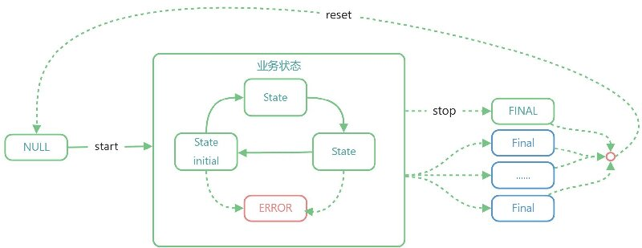
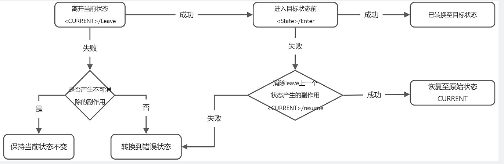

# 指南

# 状态机
## 转换流程

整体转换流程如下：



- 创建状态机时，状态机处于`NULL`状态，这是一个特殊状态，此时状态机还没有开始启动。
- 接下来调用状态机的`start`方法来启动状态机的运行。状态机运行后，首先就会转换至`initial=true`的状态。
- 接下来状态机将受`动作`和`事件`驱动进行各种业务状态之间的转换，并在状态转换期间**触发各事件和钩子**。
- 可以指定一个`error=true`的状态作为约定的错误状态，当执行动作或钩子处理出错时，将指定或自动转换至此状态；`ERROR`状态并不是一个`Final`状态，这取决于对错误的处理方式。
- 当状态机转换到`Final`状态或者调用`stop`方法后就代表了整个状态机已结束，不能再从`Final`状态转换至任何一个状态。但是可以通过调用`reset`方法重置整个状态机。

## 创建状态机

使用状态机可以有三种方式：

- 继承状态机类
- 直接实例化状态机
- 直接实例化状态机并指定上下文

### 继承状态机类

`FlexStateMachine`是一个类，可以直接继承该类来构建自己的状态机。

- 在类静态变量`states`声明有限状态
- 在类静态变量`actions`声明动作
- 通过`@state`装饰器声明动作
- 通过`on<State>Enter`、`on<State>`、`on<State>Leave`声明状态转换钩子
- 通过`onTransition<Begin|End|Cancel>`侦听状态转换事件

```typescript
import { state, FlexStateMachine } from "flexstate"

class MyStateMachine extends FlexStateMachine{
    // 声明状态
    static states = {
      "[状态名称]":{......},
      "[状态名称]":{......},                
      ....
    }					
    static actions = {
      "[动作名称]":{......},
      "[动作名称]":{......},                
      ....
    }
      
    // 声明动作
    @state({ })
    onAction1(params){ }
    @state({ })
    onAction2(params){ }
  
    // 状态转换钩子：
    onState1Enter({from,to}){...}						// 进入状态前
    onState1({from,to}){...}							  // 已转换到指定状态
    onState1Leave({from,to}){...}						// 离开状态前
    
    onState2Enter({from,to}){...}						// 进入状态前
    onState2({from,to}){...}								// 已转换到指定状态
    onState2Leave({from,to}){...}						// 离开状态前
    
    // 状态转换监视
    onTransitionBegin({from,to}){ }			        // 当开始转换状态时
    onTransitionEnd({from,to}){ }       	            // 转换状态结束时
    onTransitionCancel({from,to}){ }			        // 转换状态被中止
    onTransition({event,from,to}){ }                 // 转换状态，包括以上所有事件
}

```
### 直接实例化状态机

通过继承`FlexStateMachine`类来引入状态机会更加简洁。但是由于Javascript无法支持多继承，因此在某此情况下可以通过直接创建`FlexStateMachine`实例的方式来引入状态机。通过直接创建`FlexStateMachine`的方式来实例化一个状态机。

```typescript
const fsm = new FlexStateMachine({ 
    context:<状态机上下文对象>,  
    // 定义所有状态
    states:{
        Initial:{          
          enter:()=>{...},
          leave:()=>{...},
          done:()=>{...}
          ...
        },
        Connecting:{...},
        Connected:{...},
        Disconnecting:{...},
        Disconnected:{...}
        .....
    },
    // 定义状态机动作 
    actions:{
        connect:{
          when:["Initial","Disconnected","Error"],   // 代表只能当处于此三种状态时才允许调用连接方法    
          pending:"Connecting",											 // 执行后进入正在连接中的状态
          execute:()=>{ }												 // 动作执行函数
        },
        disconnect:{
           when:["Connected"],     							// 代表只有在已连接状态才允许执行断开方法
           pending:"Disconnecting"						  // 执行后进入正在断开连接中的状态
           execute:()=>{ }										// 动作执行函数
        },
        ......
    },
    onTransitionBegin({event,from,to,error,params}){ }			// 当开始转换状态时
    onTransitionEnd({event,from,to,error,params}){ }       	// 转换状态结束时
    onTransitionCancel({event,from,to,error,params}){ }			// 转换状态被中止
    onTransition({event,from,to,error,params}){ }     // 转换状态，包括以上所有事件
    // 其他状态机参数
   ....
})
```


### 直接实例化状态机并指定上下文

直接实例化状态机有个问题，需要指定`声明状态/动作/钩子事件`，这样就会导致一个问题，负责具备业务逻辑的类与状态机之间的分离的，导致开发上的不方便，因此`flexstate`支持在`new FlexStateMachine({}) `时可以通过指定`context`来为状态机指定上下文,然后就可以在上下文类中声明`states`、`actions`以及`钩子事件`等。

```typescript

class MyClass extends otherClass {
    static states:FlexStateMap = {}
    static actions:FlexStateActionMap = {}
    #fsm:FlexStateMachine
    constructor(){        
        this.#fsm=new FlexStateMachine({
            context:this                // 指定当前实例作为状态机的上下文y
        })
    }
    // 声明动作
    @state({ })
    onAction1(params){ }
    @state({ })
    onAction2(params){ }
  
    // 状态转换钩子：
    onState1Enter({from,to}){...}						// 进入状态前
    onState1({from,to}){...}							  // 已转换到指定状态
    onState1Leave({from,to}){...}						// 离开状态前
    
    onState2Enter({from,to}){...}						// 进入状态前
    onState2({from,to}){...}								// 已转换到指定状态
    onState2Leave({from,to}){...}						// 离开状态前
    
    // 状态转换监视
    onTransitionBegin({from,to}){ }			// 当开始转换状态时
    onTransitionEnd({from,to}){ }       	// 转换状态结束时
    onTransitionCancel({from,to}){ }			// 转换状态被中止
    onTransition({event,from,to}){ }     // 转换状态，包括以上所有事件
}


```

## 状态机上下文

通过直接实例化状态机来使用状态机有个问题，就是状态转换钩子函数、状态转换事件等的`this`指向问题。在上例中，如果要`Connected`状态下做些什么，则需要这样做。

```typescript
class TcpClient{         
  constructor(options={}){
     this._fsm = new   FlexStateMachine({
        states:{
           Connected:{
              done:this.onConnected.bind(this)
           },
           ......
        },
        actions:{
           connect:{
             execute:this.connect.bind(this)
           },
           ......
        },
        onTransitionBegin({from,to}){ }			// 当开始转换状态时
        onTransitionEnd({from,to}){ }       	// 转换状态结束时
        onTransitionCancel({from,to}){ }			// 转换状态被中止
        onTransition({event,from,to}){ }     // 转换状态，包括以上所有事件
      
     }
  }
  onConnected(){
      //... 连接后做点什么   
  }
  async connect(){
    return await this._fsm.connect(...)
  }			// 连接方法会导致状态
}
```
上例中需要自行为状态钩子指定正确的`this`参数。这种操作方式与业务类结合比较松散。此时可以通过指定`context`参数来简化。简化后如下：
```typescript
class TcpClient extends xxxx{   
  static states={
    Connected:{ }           
    ....
  }
  constructor(options={}){
     this._fsm = new   FlexStateMachine({
         context:this,				// 重点!!! 
       
     }
  }
  onConnected(){
      //... 连接后做点什么   
  }
  onTransitionBegin({from,to}){ }			// 当开始转换状态时
  onTransitionEnd({from,to}){ }       	// 转换状态结束时
  onTransitionCancel({from,to}){ }			// 转换状态被中止
  onTransition({event,from,to}){ }     // 转换状态，包括以上所有事件
  @state(...)
  connect(){.....}
}

```
当我们为状态机指定了`context`参数时，状态机将从`context`上读取声明的`static states`、`static actions`、以及`@state`声明的动作，同时所有的状态转换钩子、转换事件侦听器均可以直接声明在`context`上，一切就好象继承了`FlexStateMachine`类一样。快速入门中的例子，可以改写如下：

```typescript
import {state, FlexStateMachine } from "flexstate"

class TcpClient extends XXXX{         
  static states = {
    //
  }
  constructor(options={}){
     this._fsm = new FlexStateMachine({ 
         context : this,                                    // 重点!重点!重点!  
     }) 
  }  
  // 其动作或钩子均可以定义在此

}
```

## 启动状态机

状态机实例化后处于一个默认的`NULL`状态，然后会自动启动，即转换到`initial=true`的状态。

- 如果所有状态均没有一个`initial=true`的状态，则自动取第一个状态为初始状态，总之状态机有且只有一个`initial=true`的状态。
- 状态机将触发`start`事件，可以通过`fsm.on("start",callback)`来订阅状态机启动事件。
- 如果不希望在实例铧时自动启动状态机，则可以配置`autoStart=false`，然后就需要自行调用`start`方法来启动状态机。

```typescript
// 默认行为：自动启动状态机
let fsm = new FlexStateMachine({
  states:["Initial","Connecting","Connected"],
})
// 关闭自动启动状态机
let fsm = new FlexStateMachine({
    autoStart:false,			
    states:["Initial","Connecting","Connected"]
}
fsm.start()
```

## 停止状态机

当调用状态机的`stop`方法后，状态机将停止运行，此时不用再执行动作和转换状态。调用`stop`方法将：

- 中止正在进行的转换状态回调
- 中止正在执行的动作
- 状态机将被重置到`NULL`状态
- 状态机将触发`stop`事件，可以通过`fsm.on("stop",callback)`来订阅状态机停止事件。
- 状态机停止后可以通过`start`再次启动。

## 运行状态

状态机本身具有以下状态：

- **NULL：**实例化但还没有调用`start`方法前的状态
- **RUNNING：**状态机调用`start`方法后会自动转换到`Initial`状态，此时状态机处于任何一个非`FINAL`状态。
- **FINAL：**当状态机转换至任一个`FINAL`状态时。此时只能通过`reset`来重置状态机。
- **ERROR：**错误状态，当状态机因为出错时

## 状态机参数

创建状态机的构造参数如下：

```typescript
const fsm = new FlexStateMachine({
  name              : "",                                         // 当前状态机名称
  parent            : null,                                       // 父状态
  context           : null,                                       // 当执行动作或状态转换事件时的this指向
  autoStart         : true,                                       // 是否自动开始运行状态机，=false需要调用.start()
  states            : {},                                         // 状态声明
  actions           : {},                                         // 动作声明
  injectActionMethod: true,                                       // 将动作方法注入到当前实例中
  injectStateValue  : true,                                       // 在实例中注入：大写状态名称的字段，其值 =状态值
  history           : 0,                                          // 记录状态转换历史，0=不记录，N=最大记录N条历史
  // 状态机转换监控回调
  onTransitionBegin:async ({event,from,to}){ }, 
  onTransitionEnd:async ({event,timeConsuming,from,to}){ },
  onTransitionCancel:async ({event,from,to}){ }, 
  onTransitionError:async ({event,error,from,to}){ },
  onTransition:async ({event,timeConsuming,error,from,to}){ },
})
```

## 状态机事件

`FlexStateMachine`类继承自`flex-decorators/liteEventemitter`，本身就是一个`EventEmitter`。状态机将在工作期间触发以下事件：

- **状态机启动事件：**`start`
- **状态机停止事件：**`stop`
- **切换FINAL状态事件：**`final`
- **转换钩子事件：**`<state>/enter`、`<state>/leave`、`<state>/done`、`<state>/resume`
- **转换生命周期事件：**`transition/begin`、`transition/cancel`、`transition/error`、`transition/end`

可以访问[flex-decorators/liteEventemitter](https://zhangfisher.github.io/flex-decorators/)查询其API

# 状态
## 声明状态
定义状态有两种方法：

-  **在类中定义静态变量states**  

```typescript
class TCPClient extends FlexStateMachine{    
    static states={...}             // 定义状态
}
```

-  **在构造参数中传入states**  

```typescript
new TCPClient({
    states:{......}
})
```

- 如果同时指定了`static states`和`构造参数中传入states`，则两者会进行合并，**构造参数中传入states优先**。

## 状态数据

- **状态数据结构**

```typescript
{
  states:{
    [状态名称]:{
        name?   : string,                             // 状态名称,一般为英文
        value   : number | null,                      // <必须，状态值，Number类型>,
        alias?  : string | undefined,                 // 可选，状态别名                                 
        title?  : string,                             //<状态标题，一般用于显示> 
        initial?: boolean,                            // <true/false,是否是初始化状态,只能有一个状态为初始状态>, 
        final?  : boolean,                            // <true/false,最终状态>                                                  
        enter?  : FlexStateTransitionHookExt,         // 当进入该状态时的钩子
        leave?  : FlexStateTransitionHookExt,         // 当离开该状态时的钩子
        done?   : FlexStateTransitionHookExt,		  // 当已切换至状态后
        resume? : FlexStateTransitionHookExt,         // 当离开后再次恢复时调用
        next?   : FlexStateNext                       // 定义该状态的下一个状态只能是哪些状态,也可以是返回下一个状态列表的函数,*代表可以转换到任意状态
        [key    : string]:any                         // 额外的参数
    },
    [状态名称]:{......},
    [状态名称]:{......},  
    [状态名称]:{......},
    ...
  }
}
```

- **实例属性直接访问状态值**。

当状态机实例化后，可以通过**实例属性直接访问状态值**。

```typescript
fsm[<状态名称大写>]  == 状态值
fsm[<状态名称>]     == 状态数据
// 例：
fsm.INITIAL == 0
fsm.CONNECTING ==1
fsm.CONNECTED == 2
fsm.DISCONNECTING == 3
fsm.DISCONNECTED == 4
```

这种行为可以通过配置状态机参数`injectStateValue=false`来关闭。

- **访问状态数据**

通过`fsm.states`可以访问所有定义的状态。

```typescript
fsm.states === {Initial:{...},Connecting:{...},Connected:{...},Disconnecting:{...},Disconnected:{...},ERROR:{.....}}
```

- **访问当前状态**

通过`fsm.CURRENT`访问当前状态值，通过`fsm.current`访问当前状态。

## 状态别名

当在类中定义状态钩子时，如果存在名称冲突时可以指定状态别名。
例如：

```typescript
class MyStateMachine extends FlexStateMachine{
    static states = {
        test:{}
    }
    // 原来的类方法
    onTest(){
    }
    onTestEnter(){}
    onTestDone(){}
    onTestLeave(){}
}
```

假设很不幸`MyStateMachine`类本身存在一个`onTest`方法，且定义了一个`test`状态。在此情况下，旧的`onTest`方法就与状态机的钩子函数冲突了。此时就可以为`test`状态指定一个别名：

```typescript
class MyStateMachine extends FlexStateMachine{
    static states = {
        test:{
            alias:"debug"
        }
    }
    // 原来的类方法
    onTest(){
    }
    onDebug(){  }
    onDebugEnter(){}
    onDebugDone(){}
    onDebugLeave(){}
}
```

## 特殊状态
### NULL
状态机实例化后，还没有调用`start`方法前的特殊状态，代表状态机还没有开始运行。当调用`start`方法后，将转换至**转换到**`initial=true`的状态。并且`NULL`状态没有相对应的钩子事件和转换事件，也就是说不会触发`onNullEnter/onNullLeave/onNull`这样的钩子函数。
### INITIAL
当指定状态`initial=true`时代表这是一个初始状态，状态机有且只能有一个`initial=true`。如果没有指定则会自动取第一个状态为初始状态。
### FINAL

状态机允许有零或多个最终状态 (`final states`)，当状态机处于`FINAL`状态时，不允许再转换至其他任意状态。只能通过只能通过`reset`方法来重置状态机。

### ERROR

当状态机执行动作出错或者转换状态出错等情况下，可能转换到`ERROR`状态。

- `ERROR`状态是一个特殊的`FINAL`状态，因此一旦转换至`ERROR`状态后，就只能通过`reset`方法来重置状态机。
- **任何状态**均可以直接转换到`ERROR`状态。
- 状态机有且只能有一个`ERROR`状态，状态值=`{name:"ERROR",value:Number.Number.MAX_SAFE_INTEGER}`
- 状态机会自动创建一个`ERROR`状态。

关于错误状态处理的更详细介绍见后续错误处理章节说明。

# 状态转换
## 转换形式
状态转换发生一般发生在执行某个操作或者某个事件行为产生时，我们**将导致状态发生变化的操作或事件称副作用**。而副作用可能是来自外部事件，也可能是来自主动执行某些操作产生的。

**基于副作用的产生，状态转换存在以下两种形式：**

- **主动转换： 执行动作**

执行某个会产生副作用的动作而导致状态发生变化，例如调用本地的`connect`方法来连接服务器，由于连接是一个异步过程，因此状态会依次发生变化，从`Disconnected->Connecting->Connected`。**主动转换对状态的转换是可预知的。**比如我们知道调用`connect`方法时，要么进入已连接，要么进入错误或断开状态，对最终的状态是可以预知的。

- **被动转换 ：响应外部事件**

基于某个已经产生副作用的事件而导致状态发生变化。例如服务器主动断开客户端连接时，会在客户端会触发`close/end`事件，从而导致客户端的状态从`Connected->Disconnected`。**被动转换则是不可预知的。**比如我们不知道服务器什么时候会将客户端断开。

在现实业务中，`主动转换`和`被动转换`往往同时存在，所以必须了解两者的区别，在编程时进行兼容处理，否则很容易导致状态混乱。**两者主要区别在于**：

- `主动转换`是基于尚未或准备发生的业务进行的主动转换，因此可以在状态转换钩子中进行拦截中止；而被动转换是基于已经发生的事实，一般不允许进行拦截中止；比如服务器已经中断了连接，则客户端则一定应该处于`Disconnected`状态，所以在`onDisconnectedEnter`进行拦截阻止进入 `Disconnected`就没有意义。
- `主动转换`和`被动转换`往往会交织在一起，比如`connect`方法，你可以在发起连接操作前`onConnectingEnter`进行拦截干预，但是一旦连接成功，触发了`connect`事件，则一定会进入`Connected`状态，因此不应该在`onConnectingLeave`中进行拦截阻止离开`Connecting`状态。我们可以看出，执行`connect`操作副作用， 导致了状态机同时产生主动转换和被动转换。
- **被动转换场景下**，我们需要在事件已经发生时，调用状态机的`transition`方法来转换至某个确定状态，相当于直接修改状态机的状态，并且特别需要注意的是：**不要在转换钩子中进行拦截阻止，否则状态将会不正确**，因为状态转换的事实已经发生。如上例中当`socket`已经触发`close/end`事件了，说明事实上状态机已经处于`disconnected`状态了，此时在转换钩子中拦截就没有意义了。
- **主动转换场景下**，则存在操作失败出错或者被拦截取消等，因此不应该直接调用`transition`方法，而是引入`动作（Action）`来转换状态（详见下节关于`Action`的说明）。

可以看出，`主动转换`与`被动转换`的**最核心的区别在于副作用是事实存在的还是尚未发生的**。


## 转换过程

状态转换分三个阶段：



- **第一步：离开当前状态 - leave**

触发`<当前状态>/leave`事件，执行`<当前状态>/leave`钩子函数。如果`leave`钩子函数执行成功则代表成功离开当前状态。如果`leave`钩子函数执行出错，则代表无法离开当前状态，将根据错误类型来决定如何处理：

- 如果抛出的是普通的`ERROR`，一般代表了在钩子函数中没有产生副作用或者产生的副作用可消除，因此当前状态将保持不变。
- 如果抛出的是`SideEffectTransitionError`，则代表产生了产生不可消除的副作用，状态机将强制转换到`ERROR`状态。

- **第二步：进入目标状态前 - enter**

在转换到目标状态前，会触发`<目标状态>/enter`事件，执行`<目标状态>/enter`钩子函数。如果`enter`钩子函数执行出错，则代表无法进入目标状态。但是由于在执行`<当前状态>/leave`钩子函数时可能产生副作用，因此将触发`<当前状态>/resume`事件，开发者应该在`<当前状态>/resume`钩子函数中消除执行`<当前状态>/leave`钩子函数时可能产生副作用。

   - 如果在`<当前状态>/resume`钩子函数中成功消除了产生的副作用（没有触发错误），则将恢复到原始状态。
   - 如果 `<当前状态>/resume`钩子函数中触发了错误，则说明无法消除副作用，因此状态机将转换至`ERROR`状态。

- **第三步：已转换至目标状态 - done**

当`<当前状态>/leave`和`<目标状态>/enter`均成功后，状态机将转换至目标状态，并且触发`<目标状态>/done`事件。注意可以订阅`<目标状态>/done`事件在转换完成后做一些事情，但是无法在`done钩子`中通过触发错误来阻止转换过程。状态机将忽略`done钩子函数`中的所有错误。

## 转换方法

状态机提供`transition`方法来**从当前状态转换至其他状态**，该方法可以在被动场景下使用，即当接收到指定事件时调用本方法来转换状态。当执行`transition`方法时，会根据`state.next`和`状态转换拦截钩子`约束下来确认是否可以成功转换到目标状态。也就是说转换能否成功，取决于目标状态是否在当前状态的`next`参数中，以及拦截钩子是否进行拦截。例如：


- `states.A.next=["B","C"]`代表可以从A状态转换到B和C状态，那么调用`transition("D")`就会出错。
- 如果A状态转换到B状态时，A/leave和B/enter两个钩子函数返回false或触发错误，则转换也会被阻止。更详细见下文介绍。

`transition`**方法签名如下：**

> `async transition(next:FlexStateArgs,params={})`

- **next**：要转换的目标状态名称或状态值
- **params**：用来传递给转换钩子函数的参数


```typescript
await fsm.transition("<目标状态名称>")
// fsm.current.name==="Initial" ,   states.Initial.next=["Connecting","Disconnected","Error"]
await fs.transition("Connecting")       // 转换成功,
await fs.transition("Connected")		// 转换失败
await fs.transition("Disconnecting")    // 转换失败
```

- **转换成功时**
   - 当前状态转换到目标状态，即`fsm.current.name === "<目标状态名称>"`
   - 转换过程会触发事件`<当前状态>/leave`、`<目标状态>/enter`、`<目标状态>Done`
   - 依次调用钩子函数 `on<当前状态>Leave`、`on<目标状态>Enter`、`on<目标状态>Done`、`on<目标状态>`

- **转换失败时**
   - 触发`TransitionError` 
   - 在转换阶段中触发执行不同的钩子函数，详见上文转换过程说明。

**最佳实践：**

> 当主动转换状态时应该采用执行动作的办法，而不应该调用`fs.transition`; 仅在被状态变化时才调用`fs.transition`方法。


## 转换限制

- **同一时刻只能存在一个转换过程**

由于有限状态机同一时刻只能处于某个状态或者处于状态转换过程中。因此，不能在从A状态转换至B状态时，又同时要转换C状态。通过`fsm.transitioning`属性可以查询当前是否正在转换中，如果`fsm.transitioning==true`时，再调用`fsm.transition({...})`则会触发`TransitioningError`

- **状态机启动后才能进行转换**

仅当调用了`start`启动状态机后才能进行状态转换和执行动作。默认情况下，状态机的`autoStart=true`，也就是说实例化状态机后会自动启动。

- **状态处于FINAL状态时，不允许再进行状态转换**

当状态机处于任一个`FINAL`状态时，将不能再转换至其他状态，也不能执行动作。

## 转换约束

每个状态的`next`参数可以用来约束**该状态只能转换到其他什么状态**。`next`参数取值支持：

- `*`：代表可以转换至任意状态
- `[<状态名称>，....,<状态名称>]`：代表只能转换到其中任一个状态
- `<状态名称>，....,<状态名称>`：代表只能转换到其中任一个状态
- `函数`：返回状态名称或者状态名称列表，代表只能转换到该函数返回的其中任一个状态


# 拦截状态

`flexstate`支持定义状态转换钩子(`Hook`)，允许对转换过程进行拦截。

## 支持的钩子类型

状态转换钩子指的是在状态转换其间调用的函数，支持以下类型的拦截钩子。

- **`enter`**：当准备进入某个状态时调用，可以通过`返回false`和`触发错误`来阻止状态转换。
- **`leave`**：当准备离开某个状态时调用，可以通过`返回false`和`触发错误`来阻止状态转换。
- **`done`**：当已转换到某个状态时调用，该钩子不处理错误，不能通过`返回false`和`触发错误`来阻止状态转换。
- **`resume`**：当执行`enter`钩子出错时，会调用上一个状态的`resume`来尝试恢复和消除`leave`产生的副作用。

## 实现原理

状态转换钩子是在调用`transition`方法转换状态时被调用的函数。`transition`方法并不是直接调用这些定义的钩子函数的，而是通过`emitAsync`来触发事件转换事件，然后钩子函数订阅事件。假设当前状态是`A`，当调用`transition("B")`方法时将发生：

- 先调用`canTransition("A","B")`方法来判断能否从`A`转换到`B状态`，如果`canTransition`返回`false`，则代表不允许从`A`转换到`B状态`，将触发`TransitionError`错误。
- 接下来会触发`emitAsync("A/leave")`事件，代表将离开`A状态`。所有`leave`钩子函数本质上均是订阅了`A/leave`事件，并且钩子函数可以通过返回`false`和`触发错误`来阻止离开`A`状态。`emitAsync`实质上是通过`Promise.all`调用所有钩子函数的。
- 如果所有订阅了`A/leave`事件的钩子函数均没有阻止离开`A状态`。接下来，应会触发`emitAsync("B/enter")`事件，所有`leave`钩子函数同样是订阅了`B/enter`事件，可以在进入`B状态`前做一些事件，也可以通过返回`false`和`触发错误`来阻止进入`B状态`。
- 如果成功进入`B状态`，则会`emitAsync("B/done")`事件。如果`B/enter`返回`false`或者`触发错误`而导致无法进入`B状态`，而会触发`emitAsync("A/resume")`

可以看出，状态机会在转换过程中，视情况触发`<State>/leave`、`<State>/enter`、`<State>/resume`、`<State>/done`等事件。因此，开发者可以通过`fsm.on(<State>/leave,callback)`、`fsm.on(<State>/enter,callback)`、`fsm.on(<State>/resume,callback)`、`fsm.on(<State>/done,callback)`来订阅转换钩子。

## 定义钩子

可以通过以下方法来声明拦截钩子，拦截钩子可以是同步函数，也可以是异步函数。

钩子函数签名如下：

```typescript
export interface FlexStateTransitionEventArguments{
    event? : 'CANCEL' | 'BEGIN' | 'END' | 'ERROR'
    from  : string
    to    : string
    error?: Error
    params?:any
    [key: string]:any
}

// 钩子参数 {from,to,error,params,retry,retryCount}
export type FlexStateTransitionHookArguments = Exclude<FlexStateTransitionEventArguments,'event'> & {
    retryCount    : number                                                  // 重试次数,
    retry         : Function | ((interval?:number)=>void)                   // 马上执行重试
}
type FlexStateTransitionHook = ((args:FlexStateTransitionHookArguments)=>Awaited<Promise<any>> | void ) | undefined  
type FlexStateTransitionHookExt = FlexStateTransitionHook | [FlexStateTransitionHook,{timeout:number}]
```


**定义钩子函数有以下几种方法：**

### **构造时传入**

```typescript
new FlexStateMachine({ 
    states:{
        Initial:{           
            enter:async function({from,to,error,params,retry,retryCount}){},
            leave:async ({from,to,error,params,retry,retryCount})=>{},
            done:async ({from,to,error,params})=>{},
            resume:async ({from,to,error,params,retry,retryCount})=>{},
        },
    }
    //...    
}
```

###  **定义类方法进行侦听**

在`类`或`context`中直接定义`on<State>Enter`/`on<State>Levae`/`on<State>Done`/`on<State>`/`on<State>Resume`实例方法，如:  

```typescript

class MyStateMachine extends FlexStateMachine{
    async onInitialEnter({from,to,error,params,retry,retryCount}){ }
    async onInitialLeave({from,to,error,params,retry,retryCount}){ }
    async onInitialDone({from,to,error,params}){ }
    async onInitialResume({from,to,error}){ }
    async onInitial({from,to,error,params}){ }
  
    async onConnectingEnter({from,to,error,params,retry,retryCount}){...}
    async onConnectingLeave({from,to,error,params,retry,retryCount}){...}
    async onConnectingResume({from,to,error,params,retry,retryCount}){ }
    async onConnectingDone({from,to,error,params})
    async onConnecting({from,to,error,params})
                                       
    async onConnectedEnter({from,to,error,params,retry,retryCount}){...}
    async onConnectedLeave({from,to,error,params,retry,retryCount}){...}
    async onConnectedResume({from,to,error,params,retry,retryCount}){...}
    async onConnected({from,to,error,params}){...}
    async onConnectedDone({from,to,error,params}){...}
    ......
}    
```

**注意：**

   - 在类中声明的钩子方法名称会使用状态名称**首字母大写形式**。
   - `on<State>`是`on<State>Done`的别名，如上例中，`onConnected`===`onConnectedDone`。一般只需要声明一个即可。

### **在状态中直接订阅事件**

```typescript
fsm.states.Connected.on("enter",({from,to,error,params,retry,retryCount})=>{ })
fsm.states.Connected.on("leave",({from,to,error,params,retry,retryCount})=>{ })
fsm.states.Connected.on("done",({from,to,error,params})=>{ })
fsm.states.Connected.on("resume",({from,to,error})=>{ })
```

### 订阅状态转换事件 

```typescript
fsm.on("Connected/enter",({from,to,error,params,retry,retryCount})=>{})
fsm.on("Connected/leave",({from,to,error,params,retry,retryCount})=>{ })
fsm.on("Connected/done",({from,to,params})=>{ })
fsm.on("Connected/resume",({from,to,error,params,retry,retryCount})=>{ })
```

## 钩子事件参数

钩子函数的参数如下：

   - `from: string`：上一个状态
   - `to: string`：下一个状态
   - `params:any`：转换时传入的参数
   - `error: Error | undefined`:  发生错误时的错误
   - `retryCount`和`retry`：用于进行重试的参数，详见错误重试说明。

## 阻止转换过程

状态转换除了受`state.next`约束外，还可以通过状态转换钩子来**拦截**约束。状态转换钩子函数在状态转换其间调用，可以**对转换行为进行拦截**并作出相应的**拦截处理**。

- **通过返回**`false`**来明确阻止转换过程。**

```typescript
class MyStateMachine extends FlexStateMachine{
    async onInitialLeave({from,to,error,params,retry,retryCount}){
       // ...
       return false           // 返回false代表不充许离开Initial状态。
    } 
}    
```

- **通过触发错误来阻止转换过程**

```typescript
class MyStateMachine extends FlexStateMachine{
    async onInitialLeave({from,to,error,params,retry,retryCount}){
       // ...
       throw new Error()
    } 
}    
```

- **通过触发**`SideEffectTransitionError`**来阻止转换到错误状态**

```typescript
class MyStateMachine extends FlexStateMachine{
    async onInitialLeave({from,to,error,params,retry,retryCount}){
       // ...
       throw new SideEffectTransitionError()
    } 
}    
```

当钩子函数触发`SideEffectTransitionError`时**代表着在该钩子函数中产生了不可消除的副作用**，将使状态机转换到`ERROR`状态。`ERROR`状态是一个`FINAL`状态，代表状态机处于最终状态。后续只能通过`reset`方法来重置状态机。

## 错误处理

转换状态或者执行动作均可能会出错，出错一般就代表着产生了副作用，最主要的表现形式就是上下文数据被污染了，必须提供正确的错误处理才可以确保状态机的工作正常。当状态机发生错误时，常见的处理方式是：

- 如果没有产生严重的副作用，则一般会进行重试恢复。
- 如果产生难以消除的副作用，则应重置状态机。

当调用`transition`方法来转换状态时，会依次调用状态的`<当前状态>/leave`，`<目标状态>/enter`、`<目标状态>/done`钩子函数。其中`leave`/`enter`这两个拦截钩子可以通过触发错误来阻止状态的转换。那么问题来了，**当拦截钩子触发错误时，应该怎么处理错误？**

- **当前状态是`A`，执行`transition("B")`，先执行`A/leave`离开`A`状态，然后执行`B/enter`时出错了，也就是说无法进入到`B状态`，此时状态机应该处于什么状态？**

此时可以恢复到A状态，但是问题是我们在`A/leave`时已经离开了`A`状态，由于在`A/leave`时已经干了一个不可描述的事（**产生的副作用了，已经污染了上下文**），那么要简单地恢复到A状态就应需要同时**恢复上下文**相关的数据，否则就可能造成数据混乱，并且可能在下次`A/leave`时产生业务混乱。可见，如果恢复到A状态，我们需要同时恢复当前的上下文数据。因此，问题就取决于，我们是否可以恢复上下文数据。如果可以，那么就可以安全的恢复到A状态；如果不行，则应该将状态机置为错误状态，让应用对状态机进行重置。

- **当前状态是**`A`**，执行**`transition("B")`**，先执行**`A/leave`**离开**`A`**状态时出错**

取决于在`A/leave`函数里面产生了多少副作用，如果产生的副作用是可消除的，则当前状态应保持不变； 如果副作用不可消除，则应该转换到错误状态，然后通过重置状态机来重新恢复上下文以消除副作用。

因此，**当拦截钩子触发错误时，错误处理方式就有两种：**

- **如果产生的副作用是可消除的，则触发错误或返回false时回退到原始状态**
- **如果产生的副作用是不可消除的，则触发`SideEffectTransitionError`转换到ERROR状态**

状态机提供了相应的方法来处理这些副作用。

### 重试

所有的钩子函数均传入`retry`和`retryCount`两个参数用来实现重试操作。当产生的副作用是可消除的时，可以由开发者来自行决定如何进行重试。

- **retry(interval)**：重试函数，能指定重试间隔
- **retryCount**：代表第几次重试

```typescript
import {RetrySignal } from "FlexStateMachine"
class MyStateMachine extends FlexStateMachine{
    async onALeave({from,to,retry,retryCount}){
       try{
           // .....干活，产生副作用，污染了上下文....
       }catch(e){
           // 如果副作用是可消除的，则进行重试
           if(retryCount<3){					 // 第几次重试
             retry(1000)						   // 延迟1秒后重试
           }else{
              throw e								// 导致转换出错，将恢复原始状态
           }
       }        
    }  
}    
// 上述retryCount<3时重试，就导致会重试3次，包括第一次执行，总共执行4次
```
### 触发转换错误 

当执行钩子函数失败时，**取决于在哪一个阶段出错**，如果在`A/leave`出错，

- 确认不会产生副作用，则只要抛出错误，状态机将保持状态不变。
- 如果确认会产生不可消除的副作用，则需要抛出`SideEffectTransitionError`，状态将转换到`ERROR`状态

```typescript
import { SideEffectTransitionError,FlexStateMachine } from "FlexStateMachine"
class MyStateMachine extends FlexStateMachine{
    async onALeave({from,to,retryIndex}){
       try{
           // .....干活，是否产生副作用，污染了上下文？？？
       }catch(e){           
         // 产生错误时可以有两个选择：
         // 1、如果确认没有产生副作用，则可以直接抛出错误，状态将保持不变
         throw e                				
         // 2、如果确认会产生不可消除的副作用，则需要抛出SideEffectTransitionError，状态将转换到ERROR状态
         throw new SideEffectTransitionError()  
       }        
    }
    async onBEnter(){      
        throw new Error()    
    }
}   
```

如果在`B/enter`阶段产生错误，则需要在`a/resume`回调中处理消除副作用。如果`a/resume`也抛出错误，则会转换到错误状态。

```typescript
import {RetrySignal } from "FlexStateMachine"
class MyStateMachine extends FlexStateMachine{
    async onALeave({from,to}){ }
    async onAResume({from,to}){
      // 当b/enter出错后，应该重新恢复到A状态，可以在此消除ALeave产生的的副作用。执行后会恢复到A状态
      ......
    }
    async onBEnter(){      
        throw new Error()    
    }
}

```
由于在A->B的转换过程中会先执行`A/leave`，在其中可能会产生副作用。因此在B/enter出错时（即无法进入B状态），触发`A/resume`事件，开发者可以在`A/resume`钩子中来消除副作用。如果`A/resume`钩子函数中能成功消副作用，则状态机将保持在A状态；如果`A/resume`钩子函数触发了错误，则代表着无法消除副作用，因此状态机将转换到`ERROR`状态。

### 转换到ERROR状态

如果开发者明确钩子函数产生的副作用是不可消除的，则可以通过`throw new SideEffectTransitionError()`来强制转换到`ERROR`状态。此时状态机会直接触发`ERROR/done`事件，但是不会触发`<当前状态>/leave`和`ERROR/enter`事件。

```typescript
class MyStateMachine extends FlexStateMachine{
    async onALeave({from,to}){
        throw new SideEffectTransitionError()
    }
    async onAResume({from,to}){
      throw new SideEffectTransitionError()
    }
    async onBEnter(){      
        throw new SideEffectTransitionError()
    }
}
```

## 转换事件
状态转换过程中的钩子事件订阅：

```typescript
let fsm = new FlexStateMachine({ })
// 在状态机上订阅
fsm.on("<状态名称>/enter",callback)
fsm.on("<状态名称>/leave",callback)
fsm.on("<状态名称>/done",callback)
fsm.on("<状态名称>/resume",callback)
//在状态上订阅
fsm.states.[状态名称].on("enter",callback)
fsm.states.[状态名称].on("leave",callback)
fsm.states.[状态名称].on("done",callback)
fsm.states.[状态名称].on("resume",callback)

```

# 动作

动作(`action`)用来执行某个副作用并导致状态发生变化，属于主动进行状态转换。

> **最佳实践：**通过执行动作来触发状态变化，而不是直接修改状态！

## 动作参数

动作可以通过多种方式进行定义，动作参数如下：

```typescript
 {
    name         : "<动作名称>",			// 指定唯一的动作名称
    alias        : "<动作别名>",			// 动作别名，当在实例中注入同名的方法时，如果指定别名，则使用该别名
    when         : [<状态>,...,<状态>],     // 指定该动作仅在当前状态是when中的一个时才允许执行动作
    pending      : "<状态>",                // 开始执行动作前切换到pending状态
    execute      : async (param)=>{.....}   // 动作执行函数，具体干活的   
    resolved     : "<状态>",                // 执行成功后切换到resolved状态
    rejected     : "<状态>",                // 执行失败后切换到rejected状态
    finally      : "<状态>",               // 无论执行成功或失败均切换到finally状态

}
```

其中`pending/resolved/rejected/finally`四个参数代表了动作执行阶段的状态值。除了直接指定状态名称外，还可以是返回状态的函数。

```typescript
 {
   // 开始执行动作前切换到pending状态
    pending      : (param)=>{
      // param是执行参数
      return "<状态名称>"           // 返回pending时的状态名称
    },                			
    // 执行成功后切换到resolved状态
    resolved     : (result)=>{
      // result是execute返回的值
      return "<状态名称>"										  
    },      
    // 执行失败后切换到rejected状态
    rejected     :  (error)=>{
      // error是execute执行出错的错误
      return "<状态名称>"										  
    },      
    // 无论执行成功或失败均切换到finally状态
    finally      :  (result)=>{
      if(result instanceOf Error){
        // 执行出错
      }else{
        // 执行成功
      }
      return "<状态名称>"										  
    },                			
    timeout      : 0,                						 // 指定动作执行超时时间
}

```
## 定义动作

动作可以通过三种方式进行定义：

### 在构建参数中传入
```typescript
const fsm = new FlexStateMachine({
  actions:{
      "<动作名称>":{
        //....动作定义....
        },
       "<动作名称>":{
        //....动作定义....
        },      
  }
})
```
### 使用@state装饰器声明

```typescript
import { state, FlexStateMachine } from "flexstate"
class MyStateMachine extends FlexStateMachine{
  @state({....动作参数....})
  async connect(param){
     // ....
  }
  @state({....动作参数....})
  async disconnect(param){
     // ....
  }
}
```
### 注册动作

```typescript
const fsm = new FlexStateMachine({...})
                                   
fsm.register({
    name:"<动作名称>",
    //....动作声明参数....
})
```

## 执行流程

执行状态机动作会导致状态变化，动作执行流程如下：

-  执行动作前，先检查当前状态是否在`when`参数中指定，如果不允许执行触发错误。
- 然后如果指定`pending`参数，则状态机会先切换至`pending`指定的状态。 
-  然后执行`execute`指定的函数：
   - 如果执行成功，则状态机会切换至`resolved`指定的状态。如果没有指定`resolved`参数，则会恢复到原始状态。如果曾经切换到`pending`状态，则需要则会保持在`pending`状态，开发者需要自行处理状态副作用。比如上例中`connect`动作没有指定`resolved`状态，则在执行`connect`前切换到`Connecting`状态，执行成功后，就会保持在`Connecting`状态，这明显就不合理。那么StateMachineSignal如果回退到原始的`Initial`状态呢，当然也是不合理的，因为有可能在`Initial/leave`和`Connecting/enter`钩子函数中已经做了一些会产生副作用的事。因此，开发者正常情况下，应该为动作的成功执行指定一个`resolved`状态。
   - 如果失败（即触发错误）则状态机切换至`rejected`指定的状态。 同样地，当指定`pending`状态时，一般也应该为执行失败指定一个`rejected`状态。
-  也可以为动作执行指定一个`timeout`，当动作执行超时时，状态机就会切换至`rejected`指定的状态。 
-  也可以指定一个`finally`值，即无论状态动作执行成功与否，执行完成后均会切换到`finally`指定的状态。 此时指定的`resolved`和`rejected`状态就无效。
-  `pending`、`rejected`、`rejected`、`finally`均支持指定一个函数，如下： 上述的`result`就是`execute`执行的返回值，因此可以动态返回一个状态值。 

```typescript
 actions:{
        connect:{  
            ...
            execute:async (params)=>{
                return 1           
            },
            resolved:( result)=>{
                retrun result>0 : "Connected": "Disconnted"
            }
        }
 }
```
## 动作函数
一般情况下，动作函数应该是一个异步函数，当然也支持同步函数。动作函数就是一个普通的函数。

- 可以为动作函数的执行指定一个`timeout`，当执行超时就会产生错误。
## 实例动作方法
默认情况下，状态机会为每一个动作生成同名的实例方法。
```typescript
import { state, FlexStateMachine } from "flexstate"
class MyStateMachine extends FlexStateMachine{
  @state({....动作定义....})
  async connect(param){
     // ....
  }
  @state({....动作定义....})
  async disconnect(param){
     // ....
  }
}

let fsm = new MyStateMachine({})
// 两个同名的封装方法
await fsm.connect()
await fsm.disconnect()
fsm.register({
  name:"reconnect",
  ....
})

await fsm.reconnect(...)

```

- 生成的同名实例方法是经过状态机封装后的同名方法。
- 可以通过配置状态机参数`injectActionMethod=false`来禁止生成实例方法。
- 默认情况下，动作实例方法出错时不会产生错误，如下：

```typescript
// 使用别名来生成实例方法
try{
  await fsm.connect()
}catch(e){
  // 不会产生错误
}
```
也就是说如果上例中的`fsm.connect`方法如果执行出错，则会按`resolved/rejected/finally`配置进行状态转换，但是不会抛出错误给开发者。通过配置`throwActionError`配置参数，可以允许抛出错误。

```typescript
let fsm = new MyStateMachine({
  throwActionError:true
})
// 使用别名来生成实例方法
try{
  await fsm.connect()
}catch(e){
  // 可以在此捕获错误
}
```

- 如果自动生成同名实例方法存在与实例名称冲突，则可以为动作指定一个别名。

```typescript
class MyStateMachine extends FlexStateMachine{
  @state({
    alias:"ConnectTo"
  })
  async connect(param){
     // ....
  } 
}
let fsm = new MyStateMachine({})
// 使用别名来生成实例方法
await fsm.ConnectTo()
```
当为状态机指定了不一样的`context`参数时，同名动作方法将被绑定到`context`对象上。可参考快速入门例子。

## 执行动作
支持两种方式来执行动作：

- 可以通过状态机实例的同名动作函数来执行动作，上例中可以直接调用`fsm.connect`来执行动作。
- 直接调用封装后的动作方法，即`fsm.actions[<动作名称>](param)`来执行动作。
```typescript
// 执行动作
await tcp.connect()
await tcp.actions.connect()   // 不应该状态转换钩子中调用
```
两种执行动作的区别在于：

- 调用实例方法（例：`tcp.connect()`）默认永远不会抛出错误，需要在动作的`rejected`参数中处理错误。
- 直接调用动作方法会抛出错误。

推荐通过调用实例方法的形式来执行动作，因此实例动作方法实质上内部通过`setTimeout(<动作函数()>,0)`来执行动作，这样设计的目的是，让动作方法可以从状态转换调用链中剥离。

## 执行反馈
执行动作会产生副作用，从而导致状态发生变化。但是副作用的产生又分为可预期和不可预期的，因此当执行动作后，如何转换状态就需要分开进行处理。

- **当动作执行是可预期的时：**

也就是说动作执行成功或出错是相对明确的，可以直接指定动作的`resolved/rejected/finally`来自动配置动作执行后的状态。

- **当动作执行是不可预期的时：**

也就是说动作执行取决于外部模块（主要是通过事件触发进行反馈），就像tcp客户端中，当调用`connect`或`disconnect`方法时，是否成功不仅取决于本地代码，还取决于服务器的行为；此种情况下，就没有必须指定`resolved/rejected/finally`参数。

## 错误处理
当动作函数执行完毕后，状态机将根据执行结果转换到`resolved/rejected/finally`指定的状态。如果指定的状态是无效的，或者转换失败，则状态机将转换到`ERROR`状态。这种情况下，就只能通过`reset`方法来重置整个状态机。

# 子状态

子状态指每个状态内部还具有自己的状态，在实际项目中是比较常见的，比较快速入门例子中当进行连接状态后：

- 客户端需要在准备认证、已认证、认证成功、认证失败等状态中切换，相当于Connected内部具有一个独立的子状态机。
- 当状态机离开`Connected`时，无论其处于`Connected`内部独立的子状态机处于何种状态，均应该停止。

## 创建子状态
`FlexStateMachine`也支持两种方式来创建子状态。

- **调用状态的**`createScope`**方法**

每个状态均可以调用`createScope`方法来创建独立的状态机，`createScope`方法返回是一个`FlexStateMachine`实例，称为**子状态机**。

```typescript
let tcp = new TcpClient({})

let connectedFsm = tcp.states.Connected.createScope({
  // ...状态机参数...
  states:{.....},
  actions:{......},
           
})
tcp.states.Connected.scope === 指向的就是创建的状态机实例
```
## 配置子状态

```typescript
class TcpClient extends FlexStateMachine{
  static states = {
    Connected:{
      scope:{
          Unauthenticated : {value:0,title:"未认证",initial:true,next:["Authenticating"]},
          Authenticating  : {value:1,title:"正在认证",next:["Authenticated"]}
          Authenticated   : {value:2,title:"已认证",next:["Unauthenticated"]},
      }
    },
    ....
  }
```
## 生命周期

- 当进入父状态时(`<父状态>/done`)时启动子状态机（即调用子状态机的`start`方法）；当进入离开父状态时(`<父状态>/leave`)时停止子状态机（即调用子状态机的`stop`方法）
- 停止子状态机后，子状态后的行为与普通状态机一样，没有任何特别的行为，详见上文<`停止状态机`>介绍。
- 当状态机进入`ERROR`状态时也会导致子状态机停止。

## 上下文
子状态机的`context`默认与父状态机的`context`一样。这意味着可以将子状态的转换钩子也定义在与父状态相同的类上。
```typescript
class TcpClient extends FlexStateMachine{
  static states = {
    Connected:{
      scope:{
          Unauthenticated : {value:0,title:"未认证",initial:true,next:["Authenticating"]},
          Authenticating  : {value:1,title:"正在认证",next:["Authenticated"]}
          Authenticated   : {value:2,title:"已认证",next:["Unauthenticated"]},
      }
    }  
  }
  // Conneted子状态的转换钩子事件也可以定义在父状态的类上
  onUnauthenticatedLeave({from,to}){...}
  onUnauthenticatedEnter({from,to}){...}
  onUnauthenticated({from,to}){...}

  onAuthenticatingLeave({from,to}){...}
  onAuthenticatingEnter({from,to}){...}
  onAuthenticating({from,to}){...}
  
  onAuthenticatedLeave({from,to}){...}
  onAuthenticatedEnter({from,to}){...}
  onAuthenticated({from,to}){...}
} 
  
```
## 嵌套子状态
`FlexStateMachine`理论上可以嵌套任意多层的子状态，从而形成复杂的状态树。但是当嵌套了非常多的子状态后会导致状态机变得非常复杂，我们不推荐也不应该创建一个很大很复杂状态机。

# 状态转换监控

除了状态转换钩子函数外，在状态转换过程还会触发转换生命周期监控事件。状态转换监控事件与状态钩子的区别在于，状态转换监控事件不能干预转换过程，并且执行时会忽略错误，一般用于监视状态机的运行使用。

- **transition/begin**

转换开始前触发，事件参数 `{event:"BEGIN",from,to}`

- **transition/end**

转换结束后触发，事件参数` {event:"END",from,to}`

- **transition/cancel**

当转换被取消时触发，事件参数 `{event:"CANCEL",from,to}`

- **transition/error**

当转换出错时触发，事件参数` {event:"CANCEL",error,from,to}`注意，转换生命周期事件不能像钩子函数一样通过触发错误来阻止和干预转换过程，其执行错误将被忽略。转换生命周期事件可以通过以下三种方式订阅。


## 在类中定义订阅
```typescript
class MyStateMachine extends FlexStateMachine{
    async onTransitionBegin({event,from,to}){ } 
    async onTransitionEnd({event,timeConsuming,from,to}){ }  // timeConsuming值是本次转换的耗时
    async onTransitionCancel({event,from,to}){ } 
    async onTransitionError({event,error,from,to}){ } 
    async onTransition({event,timeConsuming,error,from,to}){ } 
}    
```
其中`onTransition`同时订阅所有转换事件。
## 在构建参数中传入
```typescript
const fsm = new FlexStateMachine({
    states:{...},
    onTransitionBegin:async ({event,from,to}){ }, 
    onTransitionEnd:async ({event,timeConsuming,from,to}){ },
    onTransitionCancel:async ({event,from,to}){ }, 
    onTransitionError:async ({event,error,from,to}){ },
    onTransition:async ({event,timeConsuming,error,from,to}){ }, 
})    
```
## 直接事件订阅
```typescript
const fsm = new FlexStateMachine({...})    
fsm.on("transition/begin",async ({event,from,to}){ })
fsm.on("transition/end",async ({event,timeConsuming,from,to}){ })
fsm.on("transition/cancel",async ({event,from,to}){ })
fsm.on("transition/error",async ({event,error,from,to}){ })
```
## 记录转换历史

状态机具有一个`history`的参数，启用后可以记录状态机的转换历史记录，通过`fsm.history`可以访问。`history=<数字>`代表要记录最后几条转换历史，如`history=100`代表要记录最后`100`条转换历史，超过会不记录。`fsm.history`格式如下：
```typescript
fsm.history=[
  [timestamp,state],
  [timestamp,state],
  [timestamp,state],
  [timestamp,state],
  ......
]
```
转换历史记录可供进行状态机的诊断使用。 
