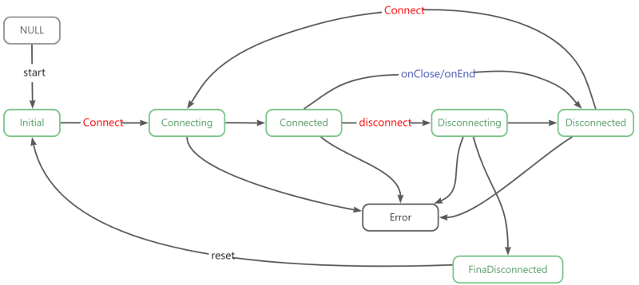
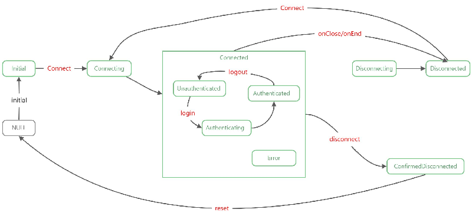

# 快速入门
下面我们以开发基于`nodejs/net.socket`的TCP客户端为例来说明`FlexStateMachine`的使用。

作为例子，我们为`TCPClient`设计以下几种状态：

- `Initial`：初始状态，构建socket实例后处于该阶段。
- `Connecting`：连接中，当调用Connect方法，触发connect事件前。
- `Connected`：已连接，当触发connect事件后。
- `Disconnecting`：正在断开，当调用destory或end方法后，end/close事件触发前。
- `Disconnected`：被动断开，当触发end/close事件后。
- `AlwaysDisconnected`: 主动断开状态
- `IDLE`: 自动添加的空闲状态，状态机未启动时
- `ERROR`: 自动添加的错误状态,特殊的`FINAL`状态

**`TCPClient`的状态图如下：**



# 第一步：构建状态机

推荐直接继承`FlexStateMachine`来创建一个`TCPClient`实例，该种方式更加简单易用。

```typescript

import { state, FlexStateMachine } from "flexstate"

class TcpClient extends FlexStateMachineMachine{
  // 定义状态
    static states = { 
        Initial : { value:0, title:"已初始化", next:["Connecting","Connected","Disconnected"],initial:true},
        Connecting	: { value:1, title:"正在连接...", next:["Connected","Disconnected"] },
        Connected : { value:2, title:"已连接", next:["Disconnecting","Disconnected"] },
        Disconnecting : { value:3, title:"正在断开连接...", next:["Disconnected"] },
        Disconnected : {value:4, title:"已断开连接", next:["Connecting"]},
        AlwaysDisconnected	: {value:5, title:"已主动断开连接", next:["Connecting"]}
    }                   

    constructor(options:FlexStateOptions){
      super(Object.assign({
        host:"",
        port:9000,
        autoStart:true,
        context           : null,                // 状态上下文对象，当执行动作或状态转换事件时的this指向
        autoStart         : true,                // 自动启动状态机
        timeout           : 30 * 1000            // 当执行状态切换回调时的超时，如enter、leave、done回调
        injectActionMethod: true,                // 将动作方法注入到当前实例中  
      },options)) 
    } 

    @state{
        when:["Initial","Disconnected","Error"],   // 代表只能当处于此三种状态时才允许调用连接方法    
        pending:"Connecting",						// 执行后进入正在连接中的状态
    }
    connect(){
        this._socket.connect(this.options)    
    } 
    @state({
        when:["Connected"],     	// 代表只有在已连接状态才允许执行断开方法
        pending:"Disconnecting"
    })  
    disconnect(){
        this._socket.destory()
    }
    // 当状态转换成功后会调用此方法
    ontTransition({error,from,to,done,timeConsuming}){
        console.log(`从<${previous}>转换到<current>,耗时:${timeConsuming}ms`)       // 例 ==> 从<Connecting>转换到<Connected,耗时12ms>
        console.log(this.current)                          // {name,value,....}
    }
    onData(data){....}
    }
```
**说明：**

- 以上我们创建了一个继承自`FlexStateMachine`来创建一个`TCPClient`实例
- 并且定义了`Initial`、`Connecting`、`Connected`、`Disconnecting`、`Disconnected`、`AlwaysDisconnected`共六个状态以及状态之间的转换约束。同时，状态机还会自动添加一个`ERROR`和`IDLE`状态。
- 定义了`connect`和`disconnect`两个动作`action`，在这两个方法前添加`@state`代表了当执行这两个方法会导致状态变化。


# 第二步：初始化TCPSocket

当实例化`TCPClient`实例后，首先应该创建Socket实例。由于`TCPClient`实例继承自`FlexStateMachine`，并且我们指定了`Initial`为初始化状态。
状态机会在实例化并启动后自动转换到`Initial`状态。因此，我们可以在进入`Initial`状态前进行初始化操作。

```typescript
class TcpClient extends FlexStateMachine{
  // 转换至Initial状态前会调用方法
  async onInitialEnter({retry,retryCount}){
    try{      
        this._socket = new net.Socket()
        // 当连接成功时，切换到Connected事件; 每一个状态均有一个大写的状态值实例成员
        // this.CONNECTED==this.states.Connected.value
        this._socket.on("connect",()=>this.transition(this.CONNECTED)) 
        this._socket.on("close",()=>{
            //....     详见后续重连说明
        }) 		
        // 套接字因不活动而超时则触发，这只是通知套接字已空闲，用户必须手动关闭连接。
        // 通过事件触发方式来执行disconnect动作
        this._socket.on("timeout",()=>this.emit("disconnect"))
        this._socket.on("error",()=>this.transition(this.ERROR))
        this._socket.on("data",this.onData.bind(this))
    }catch(e){
        if(retryCount<3){
            retry(1000)                                      // 1000ms后重试执行
        }else{				//
            throw e
        }      
    }
}

```

当`TCPClient`实例化，状态机处于`IDLE`状态(`<tcp实例>.current.name=='IDLE'`),然后状态机自动启动(`autoStart=true`)将转换至`Initial`状态（`initial`状态）。

- 状态机转换至`Initial`状态前会调用`onInitialEnter`。我们可以在此方法中创建`TCP Socket`实例以及其他相关的初始化。
- `onInitialEnter`成功执行完毕后，状态机的状态将转换至`Initial`。（`IDLE`->`Initial`）
- 如果在`onInitialEnter`函数初始化失败或出错，则应该抛出错误。错误将导致状态机将无法转换至`Initial`状态，也就无法进行后续的所有操作了。一般在初始化失败时，会进行如下操作：
   - 进行重试操作，直至初始化成功（即成功创建好Socket并进行相应的事件绑定）。
   - 反复重试多次失败后，也可能会放弃重试，`TCP Client`将无法切换到`Initial`状态，而是保持在`IDLE`状态。
   - 当条件具备时，状态机需要重新运行（即调用`tcp.start()`来启动状态机），将重复上述过程。
   
# 第三步：连接服务器

当`TCPClient`实例初始化完成后，就可以开始连接服务器。我们可以在类上创建状态机动作`connect`,启动连接操作。

```typescript
import { state, FlexStateMachine } from "flexstate"

class TcpClient extends FlexStateMachine{
    // 通过装饰器来声明这是一个状态动作  
    @state({
        // 代表只能当处于此三种状态时才允许执行动作，即调用连接方法
        when:["Initial","Disconnected","Error"],      
        // 执行后进入正在连接中的状态
        pending:"Connecting"	
    })                
    async connect(){      
        this._socket.connect(this.options)          
    }
}
// 创建连接实例
let tcp = new TcpClient({...})
// 连接
tcp.connect()   
// 状态机状态将变化: Initial -> Connecting -> Connected
// 如果连接出错状态将变化：Initial -> Connecting -> Error
```

上述的`@state({....})`定义了一个状态机动作,代表当调用`connect`方法时会导致一系列的状态转换：

- 动作名称为`connect`，会创建一个同名的实例方法`tcp.connect`替换掉原始的`connect`方法。
- `when`参数代表了只有当前状态为[`Initial`、`Disconnected`、`Error`]其中一个时才允许执行`connect`动作。
- `pending="Connecting"`代表，执行`connect`动作前，状态机的状态将暂时会切换至`Connecting`，也就是会显示`正在连接中`。由于连接操作可能是耗时的，所有设计一个正在连接中是比较符合实际业务逻辑的。
- 如果执行`socket.connect({...}) `出错，可以通过`@state({retry,retryCount})`来启用重试逻辑。需要注意的是 调用`connect`成功仅仅代表该方法在调用时没有出错，并不代表已经连接成功。是否连接成功需要由`socket/connect`事件来触发确认。
- 在上述中，并没有显式指定当连接成功时的状态，原因是因为`connect`方法是一个异步方法，是否连接成功或失败是通过事件回调的方式转换状态的。在初始化阶段，我们订阅了`close`、`end`等回调。
   - `this._socket.on("close",()=>this.transition(this.DISCONNECTED))`
   - `this._socket.on("end",()=>this.transition(this.DISCONNECTED))`
   - `this._socket.on("error",()=>this.transition(this.ERROR))`

当执行`socket.connect`方法后，如果接收到`close`/`end`/`error`则会转换到对应的`DISCONNECTED`、`ERROR`状态。

- 至此，实现了当`tcp.connect`方法，状态转换到`Connecting`状态，**连接成功**转换至`Connected`状态，**连接被断开**转换至`Disconnected`状态，**出现错误**时转换到`ERROR`状态。并且在出错时会进行一定重试操作，更多关于重试的内容详见后续介绍。

# 第四步：侦听连接状态 

在TCP连接生命周期内，状态机会在最后`Initial/Connecting/Connected/Disconnecting/Disconnected/AlwaysDisconnected`状态之间进行转换，我们希望可能侦听状态机的状态转换事件，以便在连接发生状态转换时进行一些操作，此时就可以侦听各种连接事件。

侦听连接状态有两种方法：

- **`FlexStateMachine`本身就是一个EventEmitter，可以通过订阅事方式进行侦听。**

```typescript
// *****侦听某个状态事件*****

tcp.on("Connected/enter",({from,to})=>{
    // 当准备进入连接前状态时触发此事件
})      

tcp.on("Connected/leave",({from,to})=>{
    // 当准备要离开连接状态时触发此事件
})  

tcp.on("Connected/done",({from,to})=>{
    // 当切换至连接状态后触发此事件
})   

```

- **在类中也可以直接定义`on<状态名>Enter`、`on<状态名>`、`on<状态名>Done`、`on<状态名>Leave`类方法来侦听事件。**

```typescript
class TcpClient extends FlexStateMachine{
  
  onInitialEnter({from,to}){...}			// 进入Initial状态前
  onInitial({from,to}){...}					// 已切换至Initial状态
  onInitialDone({from,to}){...}				// ===onInitial
  onInitialLeave({from,to}){...}		  	// 离开Initial状态时
  
  
  onConnectingEnter({from,to}){...}			// 进入Connecting状态前
  onConnecting({from,to}){...}				// 已切换至Connecting状态
  onConnectingDone({from,to}){...}      	// === onConnecting
  onConnectingLeave({from,to}){...}		  	// 离开Connecting状态时
  
  onConnectedEnter({from,to}){...}			// 进入Connected状态前
  onConnected({from,to}){...}				// 已切换至Connected状态
  onConnectedDone({from,to}){...}			// ===onConnected
  onConnectedLeave({from,to}){...}		  	// 离开Connected状态时
  
  //...所有状态均可以定义on<状态名>Enter、on<状态名>、on<状态名>Leave事件 
  
}
```

# 第五步：断开重新连接

连接管理中的断开重连是非常重要的功能，要处理此逻辑，首先分析一下什么情况下会断开连接。

断开连接一般包括`主动`和`被动`两种情况:

- **服务器或网络问题等导致的连接断开**

此种情况属于客户端被动断开连接，一般会需要进行自动重新连接。服务器主动断开时，客户端会侦听到`end`事件，直接进入断开状态。即状态机不会切换到`Disconnecting`，而是直接至`Disconnected`。

- **客户端主动断开连接**

此种情况属性客户主动断开连接发，就是客户端主动调用`disconnect`方法，一般是不需要进行自动重连的。
主动断开时，需要调用`socket.end`方法，然后等待`end`事件的触发。状态机会经历从`Disconnecting`到`Disconnected`的过程。

无论是主动断开连接还是被动断开连接，均会触发`close`事件，因此需要在`close`事件触发时区别是主动断开还是被动断开。
为了更好地区别`主动断开`和`被动断开`，我们可以增加一个状态`AlwaysDisconnected`来代表是客户端主动断开，`AlwaysDisconnected`被设计为`FINAL`状态。
当状态机切换到`Disconnected`状态时调用`connect`动作方法来重新连接。当状态机切换到`AlwaysDisconnected`时，则不进行重新连接。
两者差别在于，如果是主动断开会经历`Disconnecting`状态，而被动断开则不会经过此状态，因此我们就可以在`on("close")`事件中处理将状态转换至`AlwaysDisconnected`或`DISCONNECTED`。


```typescript
class TcpClient extends FlexStateMachine{
  class TcpClient extends FlexStateMachine{
  ...
  // 转换至Initial状态前会调用方法
  async onInitialEnter({retry,retryCount}){
    // 在此需要确认该切换到Disconnected还是AlwaysDisconnected状态
    this._socket.on("close",()=>{
        // 主动调用disconnect方法时，状态机才会切换到Disconnecting
        if(this.current.name==="Disconnecting"){ 
            this.transition(this.ALWAYSDISCONNECTED)
        }else{
          this.transition(this.DISCONNECTED)
        }
    })
  }
  // 当切换至Disconnected状态的回调
  async onDisconnected({from,to}){
    await delay(3000)
    this.connect()								// 重新执行Connect动作
  }
  //
  async onConnectClosed({from,to}){
    
  }

  @state({
     when:"Connected",
     pending:"Disconnecting"
     // 由于调用end方法是异步操作,需要等待close事件触发后，才是真正的断开连接 
     // 因此，不能在调用disconnected返回后就将状态设置为AlwaysDisconnected
     // 也就是说不要在此配置rejected参数；
     // 假设执行this._socket.end没有出错，则状态将保持在Disconnecting状态,直至this._socket.on("close",callback)时才进行状态转换
     // rejected:""  
  })
  async disconnect(){
    // 注意：此操作是异步状态
    this._socket.end()   
  }
}
```

# 第六步：连接认证子状态

当tcp连接成功后，一般服务器会要求对客户连接进行认证才允许进行使用，而认证操作（`login/logout`）是一个耗时的异步操作，同样需要进行状态管理。当进入`Connected`状态后，状态将在`未认证`、`正在认证`、`已认证`三个状态间进行转换，并且在连接断开或者出错时马上退出这三个状态。因此，就有必要引入子状态的概念。

引入子状态后，对应的状态图更新如下：




```typescript
class TcpClient extends FlexStateMachine{
    static states = { 
     Connected		: { 
       value:2, 
       title:"已连接", 
       next:["Disconnecting","Disconnected","Error"] 
       // 定义一个独立的状态机域
       scope:{
           states:{
              Unauthenticated : {value:0,title:"未认证",initial:true,next:["Authenticating"]},
              Authenticating  : {value:1,title:"正在认证",next:["Authenticated"]}
              Authenticated   : {value:2,title:"已认证",next:["Unauthenticated"]},
          }
       }
     },  
  }  
  ......
  // 当状态机进入Connected后会启动其子状态机
  // 子状态机会转换到其初始状态Unauthenticated，然后就可以在此执行登录动作
  async onUnauthenticatedEnter({from,to}){
      this.login()								// 
  }
  onAuthenticated({from,to}){
    
  }
  @state({
    when:["Authenticating"],
    pending:["Authenticating"]
  })
  async login(){
    await this.send({
        // 认证信息
    })
  }
  @state({
    when:["Authenticated"] 
  })
  async logout(){
    await this.send({
        // 注销信息
    })    
  }
}
```
